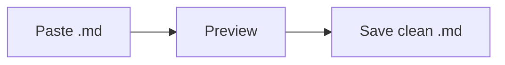
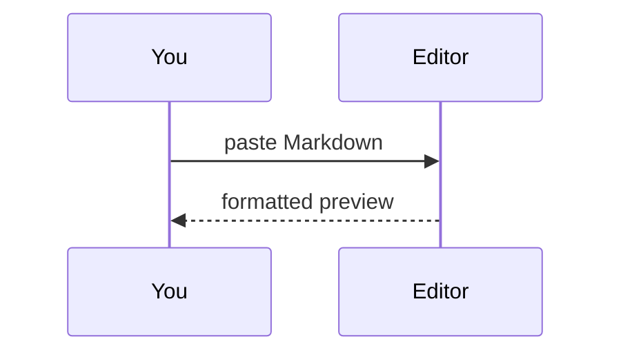

# Edit Codes — MD Pro · sample

Paste your own **.md** here, or use this file as a reference. On the right, symbols become **visual functions** — the file stays plain Markdown for the AI.

> Pasted `<script>` and `onclick` from untrusted sources appear as **text** (nothing runs). Editor features are applied locally; nothing is sent to a server.

---

## Native Markdown

### Headings

# Level 1 title
## Section title
### Subsection
#### Level 4
##### Level 5

---

### Emphasis and inline code

**bold** · *italic* · ***bold italic*** · ~~strikethrough~~ · `inline code`

---

### Unordered list

- first item
- second item
  - nested
  - another nested
- third item

---

### Ordered list

1. step one
2. step two
   1. sub-step A
   2. sub-step B
3. step three

---

### Task list

- [ ] open task
- [x] completed task
- [ ] another pending

---

### Table (GFM)

| Column | Type   | Value |
|--------|--------|-------|
| Alpha  | text   | 1     |
| Beta   | number | 2     |
| Gamma  | flag   | yes   |

---

### Blockquote and nested quote

> Blockquote for a note from the AI.
>
> > Nested quote — handy in long replies.

---

### Horizontal rule, link, and image

Text before the rule.

---

[Edit Codes](https://edit.codes) · [link with title](https://example.com "tooltip on hover")


---

### Code blocks

Enable **Code highlighting** in the optional bar for colors. Each block gets a copy button in the preview.

```js
function greet(name) {
  return "Hello, " + name;
}
greet("world");
```

```python
def average(values):
    return sum(values) / len(values)
```

---

## Editor-only: green message box

Own lines with `:::message` … `:::`:

:::message
This is **your** message to the AI — visually separated from the model's reply.
Supports normal Markdown inside the box.
:::

---

### Legacy formats (still recognized in preview)

+++
Old message block (back-compat)
+-+

---

## Math · KaTeX

> **Enable “Math (KaTeX)”** in the optional bar above. Until then, formulas stay as plain `$…$` text.

Inline: $E = mc^2$ · $x^2 + y^2 = z^2$

$$
\int_0^1 x^2 \, dx = \frac{1}{3}
$$

$$
\begin{aligned}
a^2 + b^2 &= c^2 \\
\sin^2\theta + \cos^2\theta &= 1
\end{aligned}
$$

---

## Diagrams · Mermaid

> **Enable “Diagrams (Mermaid)”** in the optional bar. Requires the local `vendor/mermaid.min.js` file.





---

## Quick checklist

1. **💾 Save .md** — downloads native source (not HTML preview).
2. Drag the file back to continue editing offline.
3. Toggle **EN / PT / ES** — UI and this sample follow the language selector (**Load sample**).

*Replace this text with your own AI-generated content. Be careful with code from others.*