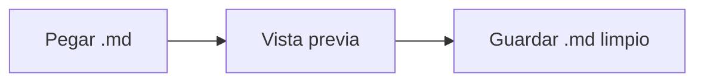
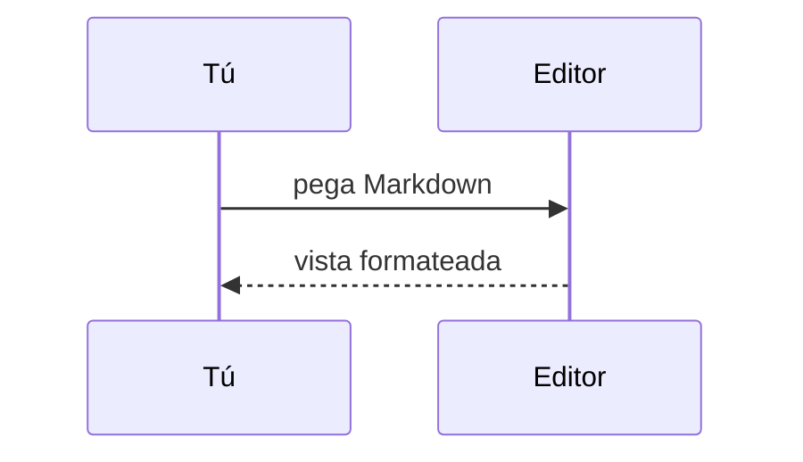

# Edit Codes — MD Pro · ejemplos

Pega tu **.md** aquí o usa este archivo como referencia. A la derecha, los símbolos se vuelven **funciones visuales** — el archivo sigue siendo Markdown puro para la IA.

> El `<script>` y `onclick` pegados de fuentes no confiables aparecen como **texto** (nada se ejecuta). Las funciones del editor son locales; no se envía nada al servidor.

---

## Markdown nativo

### Encabezados

# Título nivel 1
## Título de sección
### Subsección
#### Nivel 4
##### Nivel 5

---

### Énfasis y código inline

**negrita** · *cursiva* · ***negrita y cursiva*** · ~~tachado~~ · `código inline`

---

### Lista sin orden

- primer ítem
- segundo ítem
  - anidado
  - otro anidado
- tercer ítem

---

### Lista ordenada

1. paso uno
2. paso dos
   1. subpaso A
   2. subpaso B
3. paso tres

---

### Lista de tareas

- [ ] tarea abierta
- [x] tarea hecha
- [ ] otra pendiente

---

### Tabla (GFM)

| Columna | Tipo    | Valor |
|---------|---------|-------|
| Alfa    | texto   | 1     |
| Beta    | número  | 2     |
| Gamma   | bandera | sí    |

---

### Cita y cita anidada

> Cita para una nota de la IA.
>
> > Cita anidada — útil en respuestas largas.

---

### Regla horizontal, enlace e imagen

Texto antes de la regla.

---

[Edit Codes](https://edit.codes) · [enlace con título](https://ejemplo.com "ayuda al pasar el ratón")


---

### Bloques de código

Activa **Resaltado de código** en la barra opcional para colores. Cada bloque tiene botón copiar en la vista previa.

```js
function saludar(nombre) {
  return "Hola, " + nombre;
}
saludar("mundo");
```

```python
def media(valores):
    return sum(valores) / len(valores)
```

---

## Exclusivo del editor: caja verde de mensaje

Líneas propias con `:::message` … `:::`:

:::message
Este es **tu** mensaje para la IA — separado visualmente de la respuesta del modelo.
Markdown normal funciona dentro de la caja.
:::

---

### Formatos heredados (aún reconocidos en la vista previa)

+++
Bloque antiguo de mensaje (retrocompat)
+-+

---

## Fórmulas · KaTeX

> **Activa “Fórmulas (KaTeX)”** en la barra opcional. Sin eso, las fórmulas quedan como texto `$…$`.

Inline: $E = mc^2$ · $x^2 + y^2 = z^2$

$$
\int_0^1 x^2 \, dx = \frac{1}{3}
$$

$$
\begin{aligned}
a^2 + b^2 &= c^2 \\
\sin^2\theta + \cos^2\theta &= 1
\end{aligned}
$$

---

## Diagramas · Mermaid

> **Activa “Diagramas (Mermaid)”** en la barra opcional. Requiere `vendor/mermaid.min.js` local.





---

## Lista rápida

1. **💾 Guardar .md** — descarga el texto fuente (no el HTML de la vista previa).
2. Arrastra el archivo de vuelta para seguir sin conexión.
3. Cambia **EN / PT / ES** — la interfaz y este sample siguen el idioma (**Cargar ejemplo**).

*Sustituye este texto por tu contenido generado por la IA. Cuidado con código ajeno.*