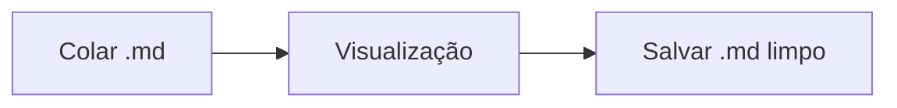
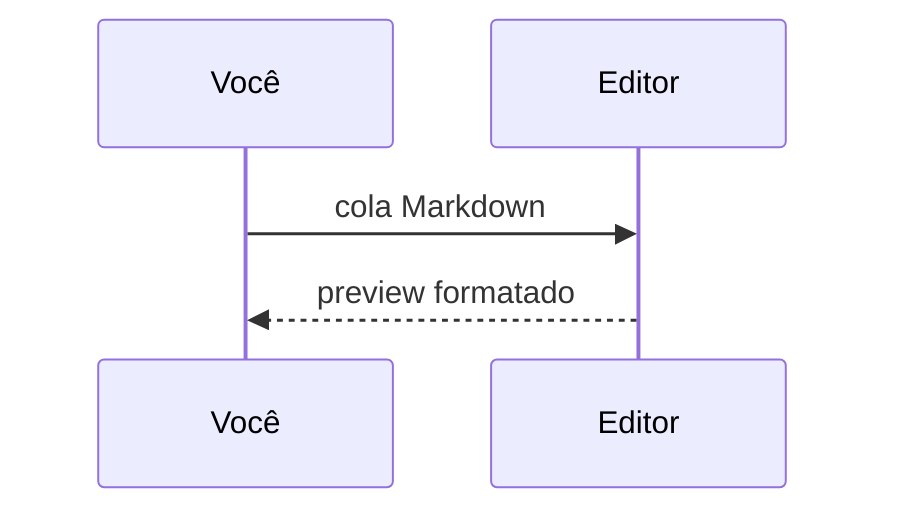

# Edit Codes — MD Pro · exemplos

Cole seu **.md** aqui ou use este arquivo como referência. À direita, os símbolos viram **funções visuais** — o arquivo continua Markdown puro para a IA.

> `<script>` e `onclick` colados de fontes não confiáveis aparecem como **texto** (nada executa). Os recursos do editor são locais; nada é enviado a servidor.

---

## Markdown nativo

### Títulos

# Título nível 1
## Título da seção
### Subseção
#### Nível 4
##### Nível 5

---

### Ênfase e código inline

**negrito** · *itálico* · ***negrito e itálico*** · ~~tachado~~ · `código inline`

---

### Lista não ordenada

- primeiro item
- segundo item
  - aninhado
  - outro aninhado
- terceiro item

---

### Lista ordenada

1. passo um
2. passo dois
   1. subpasso A
   2. subpasso B
3. passo três

---

### Lista de tarefas

- [ ] tarefa aberta
- [x] tarefa concluída
- [ ] outra pendente

---

### Tabela (GFM)

| Coluna | Tipo   | Valor |
|--------|--------|-------|
| Alfa   | texto  | 1     |
| Beta   | número | 2     |
| Gama   | flag   | sim   |

---

### Citação e citação aninhada

> Citação para nota da IA.
>
> > Citação aninhada — útil em respostas longas.

---

### Linha horizontal, link e imagem

Texto antes da regra.

---

[Edit Codes](https://edit.codes) · [link com título](https://exemplo.com "dica ao passar o mouse")


---

### Bloco de código

Ative **Realce de código** na barra opcional para cores. No preview, cada bloco ganha botão copiar.

```js
function cumprimentar(nome) {
  return "Olá, " + nome;
}
cumprimentar("mundo");
```

```python
def media(valores):
    return sum(valores) / len(valores)
```

---

## Exclusivo do editor: caixa verde de mensagem

Linhas próprias com `:::message` … `:::`:

:::message
Esta é **sua** mensagem para a IA — separada visualmente da resposta do modelo.
Markdown normal funciona dentro da caixa.
:::

---

### Formatos legados (ainda reconhecidos no preview)

+++
Bloco antigo de mensagem (retrocompat)
+-+

---

## Fórmulas · KaTeX

> **Ative “Fórmulas (KaTeX)”** na barra opcional. Sem isso, as fórmulas ficam como texto `$…$`.

Inline: $E = mc^2$ · $x^2 + y^2 = z^2$

$$
\int_0^1 x^2 \, dx = \frac{1}{3}
$$

$$
\begin{aligned}
a^2 + b^2 &= c^2 \\
\sin^2\theta + \cos^2\theta &= 1
\end{aligned}
$$

---

## Diagramas · Mermaid

> **Ative “Diagramas (Mermaid)”** na barra opcional. Requer `vendor/mermaid.min.js` local.





---

## Checklist rápido

1. **💾 Guardar .md** — baixa o texto-fonte (não o HTML do preview).
2. Arraste o arquivo de volta para continuar offline.
3. Troque **EN / PT / ES** — a interface e este sample seguem o idioma (**Carregar exemplo**).

*Substitua este texto pelo seu conteúdo gerado pela IA. Cuidado com código de terceiros.*